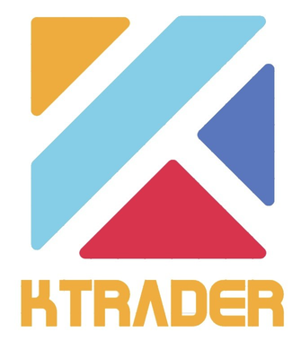

# KTrader

* Наш инструмент предлагает написание алгоритмов на языке программирования, так как разработка торговых роботов при помощи блок-схем займёт больше времени, да и менее гибкая, чем на языке программирования

* Инструмент кроссплатформенный, поэтому его можно развернуть в облаке на любой машине

* Поддерживает тестирования алгоритма на исторических данных, чтобы не тестировать через торговлю реальными акциями на бирже с сопутствующими рисками и потерями

* Opensource проект

* Наше решение поддерживает Tinkoff инвестиции
