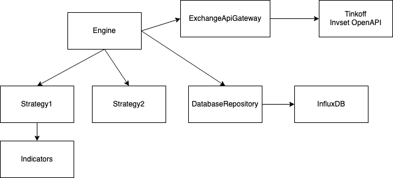

# KTrader

## Архитектура

Core является движком торгового бота. У каждой стратегии есть инструмент, которым он торгует. Не может существовать две стратегии, которые торгуют одним и тем же инструментом, иначе может возникнуть ситуация, при которой один из торговых ботов будет иметь неактуальную ситуацию.

Инициализация стратегии:
1) Engine смотрит нужны ли исторические данные для работы стратегии, если они отсуствуют, то запрашивает их у ExchangeApiGateway.
2) Engine запрашивает у ExchangeApiGateway Flow, в который поступают данные с заданной частотой стратегии для стратегии.

## Жизненный цикл стратегии

1) Init
2) Handle
3) Shutdown